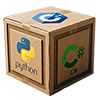

[//]: # (README.md)
[//]: # (Copyright © 2026 nTier Training. All rights reserved.)
[//]: #

    A <a href="https://github.com/boxwrx">Box Works</a> Coding Environment

# Introduction

This is a general Java development environment designed to be cloud-hosted or started in a local docker container.
It is purely an empty sandbox for playing with Java in Linux, and any subproject types: Spring, Spring Boot, etc.

In the *Terminal* tab of the *Panel* (the area below the *Editor* in VS Code), change directory to *src/main/java*.
Compile *HelloWorld.java* with `javac HelloWorld.java`.
This will leave the compiled program as *HelloWorld.class* in the same folder.
Use `java HelloWorld` at the shell prompt to execute the program.

To run or debug the program from inside of VS Code, the *.vscode* folder has been populated with default *launch.json*
and *tasks.json* files that build and run *src/main/java/HelloWorld.java*.
Clicking on the *Run and Debug* icon in the *Activity bar* at the left opens the *Run and Debug* view in the
*Side bar* to the right of the *Activity bar*.
At the top of the view is a dropdown list of *launch configurations*.
There are three configurations: *Debug HelloWorld (Maven build)*, *Debug HelloWorld (Gradle build)*, and
*Debug HelloWorld (no build step)*.
Pick the *Maven* or *Gradle* option and launch the debugger with the run button to the left of the dropdown, or
from the menu pick <code>Run &rarr; Start Debugging</code> or <code>Run &rarr; Run Without Debugging</code>.

The default *launch.json* configuration is the template to build configurations for running and debugging any other program files in
the project.
This environment is configured to use either Maven or Gradle.
Maven builds the project to the /target folder, while Gradle puts it together in /build.

## Sandbox Instantiation

There are three ways to initialize and use the development environment.
Pick the one which best serves your needs:

## &#9312; Run in a local Docker container:
<blockquote>
    The interface to the environment running in a local container is the Visual Studio Code application.
        <a target="_blank" href="./.assets/resources/local_install.md">This page</a> will provide instructions for installing the applications for a local environment.
        Follow these steps to launch the sandbox: 
    <ol>
        <li>Clone this project from GitHub onto a local computer with Docker available.</li>
        <li>Open the folder in VS Code.</li>
        <li>Wait for VS Code to notice the <i>devcontainer.json</i> configuration file and ask if you want to launch the workspace in Docker,</li>
        <li>or use the menu item <code>View &rarr; Command Palette...</code> and select the <code>Dev Containers: Reopen in Container</code>
            command to manually launch the project in a local Docker container.</li>
    </ol>
     Work performed in the container will persist until the container is deleted.  
    There are several documentation paths to understanding this setup; Docker, Docker Desktop, and integrating a dev container with VS Code: 
    <ol type="a">
        <li>Docker Documentation (start with "Docker Basics"): <a href="https://docs.docker.com">https://docs.docker.com</a></li>
        <li>Docker Desktop: <a href="https://docs.docker.com/desktop/">https://docs.docker.com/desktop/</a></li>
        <li>VS Code and dev containers: <a href="https://code.visualstudio.com/docs/devcontainers/containers">https://code.visualstudio.com/docs/devcontainers/containers</a></li>
    </ol>
    </blockquote> 

## &#9313; Run in a virtual GitHub Codespace:
<blockquote>
    A Codespace is a Docker cotnainer running in a Debian Linux virtual computer at GitHub.
    You must be signed onto a personal GitHub account to launch the Codespace.
    Do not use an enterprise account, it may be restricted for running Codespace, or GitHub may charge the account for the Codespace.  
    If you are looking at this repository open in GitHub follow these steps: 
    <ol>
        <li>Scroll up and click the <i>code</i> button at the top of the repository.</li>
        <li>Select the <i>Codespaces</i> tab.</i>
        <li>Click the button to <i>Create codespace on main</i>.</li>
    </ol>
     Work performed in the Codespace will persist until Codespace is deleted.  
    The documentation for GitHub Codespaces begins here: <a href="https://docs.github.com/en/codespaces">https://docs.github.com/en/codespaces</a>.
    </blockquote> 

## &#9314; Run in a virtual Google Cloud Shell:
<blockquote>
    A Cloud Shell is a Debian Linux virtual computer hosted at Google.
    You must be signed onto Google with a personal account to launch the virtual computer.
    Do not use an enterprise account, it may be restricted for running a Cloud Shell, or Google may charge the account for the Cloud Shell usage.  
    After clicking on the link below, once the cloud shell starts in a new browser tab follow these instructions: 
    <ol>
        <li>In the <i>Open in Cloud Shell</i> dialog check "Trust repo" and click <i>Continue</i>.</li>
        <li>If an <i>Authorize Cloud Shell</i> dialog appears click <i>Authorize</i>.</li>
        <li>A <i>Cloud Shell Tutorial</i> will appear on the right side of the brower window.
        Continue with the instructions provided there.</li>
    </ol>
    The workspace will persist in your Google Cloud Shell until it is deleted.  
    <a href="https://shell.cloud.google.com/cloudshell/editor?cloudshell_git_repo=https://github.com/boxwrx/clang-devbox&cloudshell_workspace=.&&cloudshell_tutorial=.assets/resources/gcs_tutorial.md">Click this link to launch this repository in Google Cloud Shell in the browser</a> (right-click if you want to open it in a new tab). 
    <h3>Restarting Google Cloud Shell</h3>
    If your environment times out and you cannot reconnect in the browser tab, or if you shut down the browser and want to get back to your work,
    use <a href="https://ide.cloud.google.com">https://ide.cloud.google.com</a> to launch the environment with the IDE.
    This should reopen the workspace that was last open.
    If it does not, or you want to change to a different workspace,
    in the IDE use the menu <code>File &rarr; Open Recent</code> and pick the recent workspace you want to open.
    Or, use <code>File &rarr; Open Folder...</code> and browse to the workspace folder under <i>$HOME/cloudshell.open</i>.
    By the way, if you delete a workspace folder from $HOME/cloudshell_open and then relaunch cloud shell, you will get a "Workspace not found" error.
    Delete workspaces when you are finished to conserve storage space.  
    The documentation for Google Cloud Shell begins here: <a href="https://docs.cloud.google.com/shell/docs">https://docs.cloud.google.com/shell/docs</a>.
    </blockquote>

